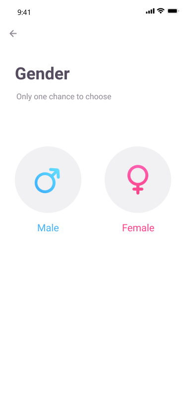
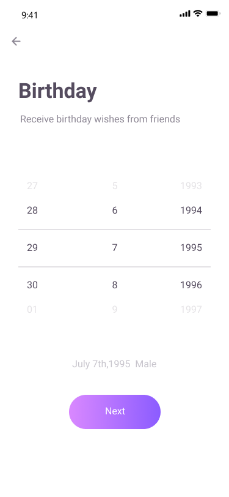
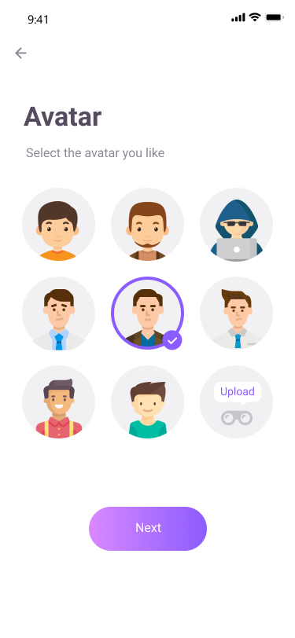
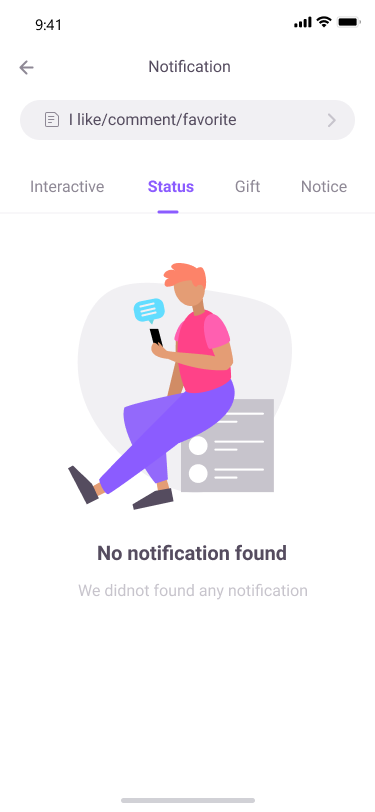
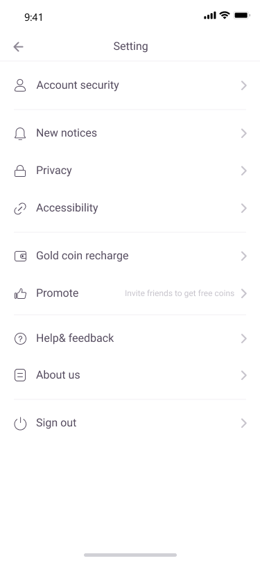

# 陌聊 App

跨平台陌生人聊天 App，支持 Android 和 iOS。

[服务器代码](https://github.com/whisperingmoves/strangerchat-api)

## 安装 React Native 开发环境（0.72）

[React Native - 环境安装](https://reactnative.dev/docs/environment-setup)

## 安装项目依赖

```bash
npm install
```

## 修改配置文件

将 .env.sample 文件拷贝成一个新文件，并将文件重命名为 .env ，然后修改 .env 文件

## 运行项目

启动Metro：

```bash
npm start
```

## 功能展示

- 注册登录


- 发送验证码


- 选择性别



- 选择生日



- 选择头像



- 首页（附近的人，新的动态）


- 探索页（关注的人）


- 探索页（推荐的人）


- 模糊搜索


- 发布帖子


- 聊天列表


- 用户资料页


- 聊天详情页


- 通知列表页




- 签到奖励


- 帖子详情页


- 关注用户列表


- App 设置



- 金币充值


- 礼物排行榜


- 聊天送礼


- 聊天礼物充值


